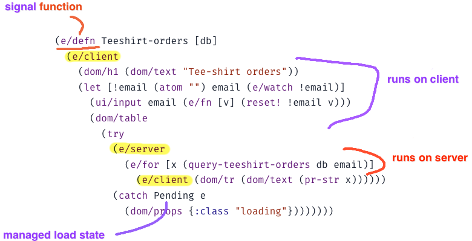

# Electric Clojure – a signals DSL for fullstack web UI, with compiler-managed network sync

Electric is a **reactive and network-aware Clojure/Script dialect** that fully abstracts over web data sync at the programming language layer, in order to bring **true composability** across the frontend/backend boundary. There is no artificial network divide between queries and views, query and view compose directly. The Electric macros will, at compile time, analyse your unified frontend/backend Clojure/Script program to transparently partition and distribute it across the client/server distributed system. There is no client/server dichotomy from the programmer's perspective. All IO and effects are managed.



*Figure: This is not RPC or client-side ORM. The Electric compiler performs deep graph analysis of your holistic frontend/backend program to automatically determine the optimal network interface, and compile your unified program down to separate client and server target programs that cooperate and anticipate each other's needs.*


- **Fully reactive:** unlike javascript frameworks, in Electric, reactivity is built directly into the programming language itself. Reactive-if, reactive-for, reactive try/catch. When everything is reactive, it feels like nothing is reactive. No async types! No function coloring problem!


- **Multi-tier**: frontend and backend are defined in the same expression, same function, same file. It's not code sharing, it's code *splitting*. Let the compiler infer the boundary from your code, instead of contorting your code — nay, your entire architecture — to fit the boundary.


- **Network-transparent**: Electric closures close over server and client scope bindings, all in the same expression. The Electric compiler uses compile-time static knowledge of your source code to slice your expressions into client and server portions, right through closures, loops and deeply nested function calls.


- **Multiplayer-native:** everything is automatically multiplayer, 0 LOC cost.


- **5k LOC:** Tight enough that you can dig in, see how it works, and contribute.

> "If a system is to serve the creative spirit, it must be entirely comprehensible to a single individual. Human potential manifests itself in individuals." — Dan Ingalls, Design Principles Behind Smalltalk
 
Our Mission = to raise the abstraction ceiling in web development, paving the way for something new.

## Motivation


## How it works
* UIs are streaming DAGs
* You don't need a web framework, you need a web language
* https://hyperfiddle.notion.site/hyperfiddle-2fbeb20831984307ab7e485784b182a1

Tradeoffs
* Less than you might think
* trapdoor to manual IO
* security - actually no

## Dependency
- Project maturity = [alpha](https://clojure.org/releases/devchangelog). Ready for brave clojurists. See demos and progress updates. 
- Reliable core tech after 8 months of user testing and hardcore dogfooding in our other projects.
- Current dev priority is developer experience and performance, based on learnings from production use in back-office commercial apps.

```clojure
; stable
{:deps {com.hyperfiddle/electric {:mvn/version "v2-alpha-0-g7bac2441"}}}
```

## Getting Started

Standalone starter repo to fork:
* https://github.com/hyperfiddle/electric-starter-app

Demos, examples, tutorials are in this repo:

```bash
clj -A:dev -X user/main     # healthcheck app http://localhost:8080
```
* `dev` alias
* `(user/main)` compiles assets and serves app

* see [src-docs/user/](https://github.com/hyperfiddle/photon/tree/master/src-docs/user) for demos and tutorials
* App entrypoint: src-dev/[user.clj](https://github.com/hyperfiddle/photon/blob/master/src-dev/user.clj), [user.cljs](https://github.com/hyperfiddle/photon/blob/master/src-dev/user.cljs)

## IDE setup

* [docs/ide_emacs.md](docs/ide_emacs.md)
* [docs/ide_cursive.md](docs/ide_cursive.md)

## Clojure compat matrix

- no variable e/fn arity yet
- no recursion yet - see workaround in [src-docs/user/photon/photon_recursion](https://github.com/hyperfiddle/electric/blob/master/src-docs/user/photon/photon_recursion.cljc)
- reactive multimethods (Clojure multimethods work)
- reactive protocols (Clojure protocols work)
- ...

## Known issues
Errors
* Requires -Xss2m to compile. default 1m JVM ThreadStackSize is exceeded by the Electric compiler due to large macroexpansion resulting in false StackOverflowError during analysis.
* :eval opcode - probably interop syntax, or a macro like assert that expands to interop syntax
* `Unbound var.` Usually means wrong peer, i.e. accessed server-only var on client

## Community

* #hyperfiddle @ clojurians.net
* https://twitter.com/dustingetz for updates
